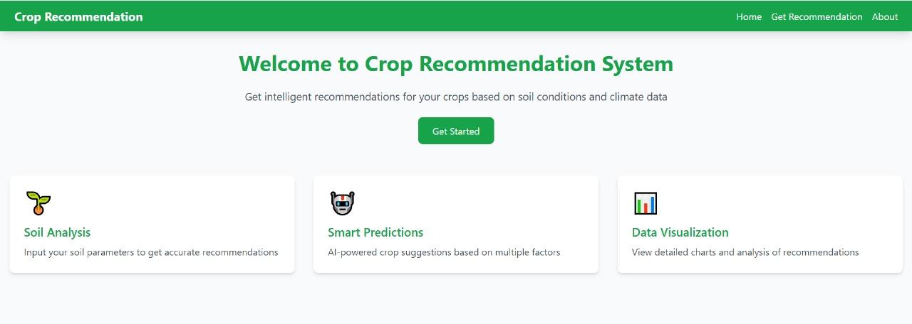
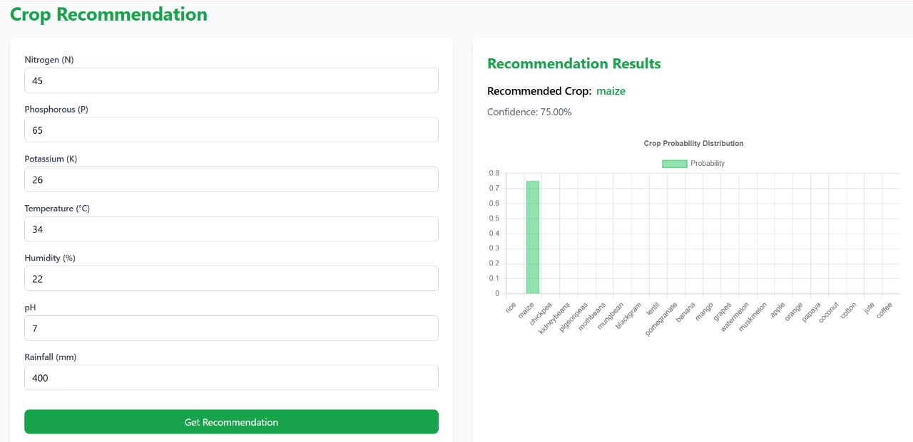
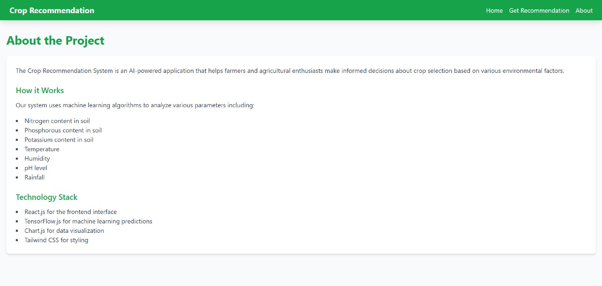

# AI-Crop-Recommendation
Website :  https://calm-melomakarona-72c732.netlify.app/

## Optimize your farming with AI-driven crop recommendations

Simply input soil and weather data, and get personalized crop suggestions backed by advanced machine learning.
Start farming smarter today—visit now! 
Revolutionize your farming journey with AI-powered crop recommendations! 

Our advanced technology analyzes soil quality, weather patterns, and market trends to guide you toward the best crops for maximum yield and profit. 
Whether you're a seasoned farmer or just starting, this tool ensures smarter, data-driven decisions to enhance sustainability and boost productivity.

## Outputs:

## AI Crop Recommendation: Website Overview & Workflow

## Project Objective:
Leverage AI to recommend the best crops based on soil data, weather, and market trends for enhanced farming efficiency. 

## Frontend:

Technology: HTML, CSS, JavaScript.
Design: Responsive UI for seamless user experience across devices.
Features: Input form for soil data and weather conditions.

## Backend:

Technology: Python Flask.
API: Handles user input and communicates with the ML model for predictions.

## ML Integration:

Model: Trained using datasets of soil nutrients, rainfall, temperature, and crop yields.
Implementation: Model deployed on the backend, generating crop recommendations in real time.

## Database:
Stores user data, crop suggestions, and historical inputs for analysis.

🌍"Empowering farmers with AI—better decisions, better crops, better future!" 🌟

💡 "Let AI be your farming partner—grow more, earn more, and do it smarter than ever before." 🌱✨
